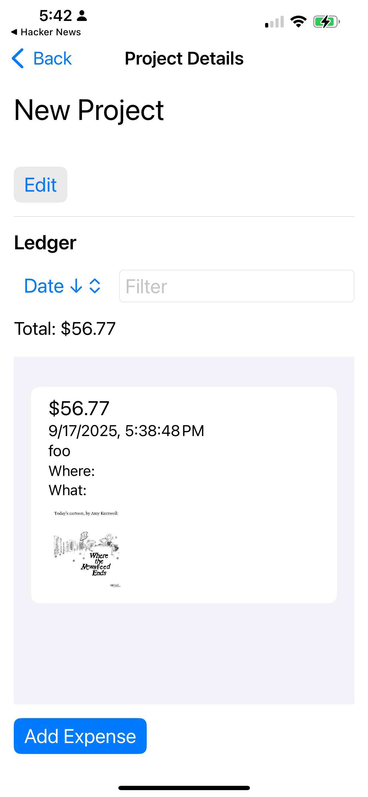

# Project Ducats

A project expense tracker iOS app for managing project-based expenses with receipt capture and ledger management.

## Overview

Project Ducats helps you track expenses across multiple projects, providing a clear view of project costs and spending patterns. Each project maintains its own ledger of expenses, with the ability to capture and store receipt photos for proper documentation.

## Features

- **Project Management**: Create and manage multiple projects
- **Expense Tracking**: Add expenses to specific projects
- **Receipt Capture**: Take photos of receipts and associate them with expenses
- **Project Ledgers**: View detailed expense listings for each project
- **SwiftData Integration**: Local data persistence with modern Core Data replacement

## Technology Stack

- **Platform**: iOS
- **Language**: Swift
- **UI Framework**: SwiftUI
- **Data Framework**: SwiftData
- **Architecture**: MVVM with SwiftUI

## Requirements

- iOS 17.0+
- Xcode 15.0+
- Swift 5.9+

## Getting Started

1. Clone the repository
2. Open the project in Xcode
3. Build and run on simulator or device

## Project Structure

The app follows standard SwiftUI + SwiftData architecture:

- **Models**: SwiftData models for Project and Expense entities
- **Views**: SwiftUI views for project and expense management
- **ViewModels**: Observable objects managing app state
- **Utilities**: Helper classes for camera integration and data management

## Core Functionality

### Projects
- Create new projects
- View project details
- Access project-specific ledgers

### Expenses
- Add expenses to projects
- Capture receipt photos
- Edit expense details
- Delete expenses

### Ledger
- View all expenses for a project
- Sort and filter expenses
- Calculate project totals

## Contributing

1. Fork the repository
2. Create a feature branch
3. Make your changes
4. Submit a pull request

## License

[License information to be added]

## Notes

on 17 sept 2025, I spent 1:40 creating the app from scratch to an MVP state with SwiftData models, project and expense management, receipt capture, and basic UI. Further enhancements and polish will be done in future iterations.

